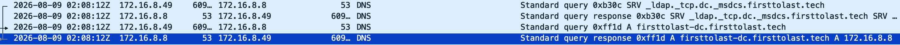
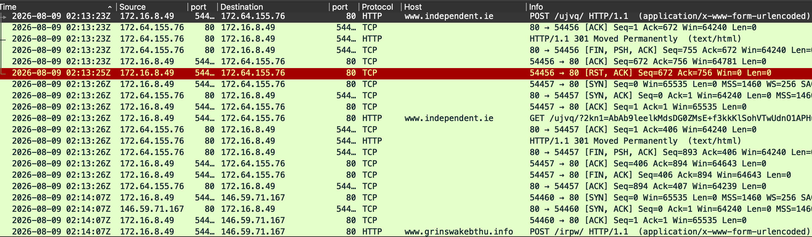
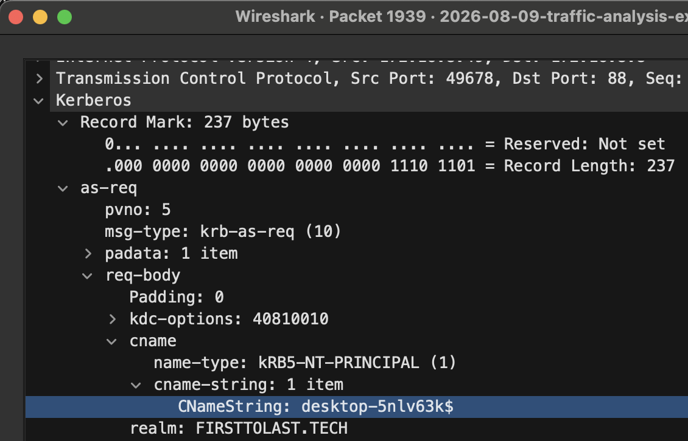
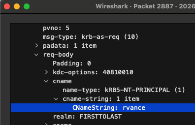
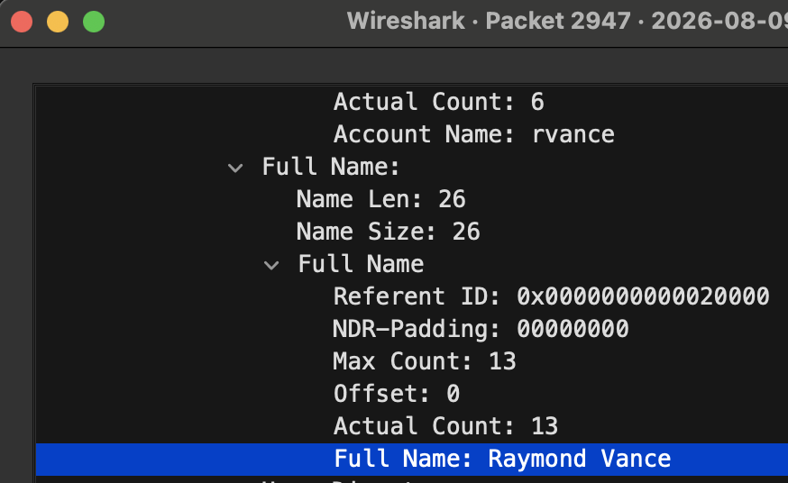

# Traffic Analysis Report: FormBook C2 Activity on Host 172.16.8.49

**Analyst:** CJ Turesko
**Report date:** 2026-09-06
**Classification:** Training exercise (not a real-world incident)
**Source material:** Public pcap from the malware-traffic-analysis.net post ["2026-08-09: Traffic Analysis Exercise: First to Last"](https://www.malware-traffic-analysis.net/2026/08/09/index.html)

> This write-up is based on a publicly available training pcap, analyzed independently in Wireshark as SOC-analyst practice. It is not a redistribution of the original file; the pcap itself remains available directly from malware-traffic-analysis.net under its own access terms.

---

## 1. Executive Summary

Between 02:13 and 02:16 UTC on 2026-08-09, the SOC alerting stack fired six "FormBook CnC Checkin" signatures, each pointing to a different external IP address. Correlating those six IPs against the packet capture identified a single internal host, **172.16.8.49 (DESKTOP-5NLV63K)**, communicating with all six over HTTP in a pattern consistent with FormBook's POST-then-GET C2 beaconing. Kerberos traffic from the same host identified the logged-on user as **rvance**, and a follow-up SAMR lookup against the domain controller resolved that account to the full name **Raymond Vance**. C2 activity continued in beacon-like intervals through 02:21 UTC, matching the end of the capture window. No initial infection vector (e.g., the delivery email or dropper download) is visible in this capture. The recorded window begins after the host was already beaconing.

| Item | Value |
|---|---|
| Infected host (IP) | 172.16.8.49 |
| Hostname | DESKTOP-5NLV63K |
| MAC address | 00:12:f0:28:d4:34 |
| Logged-on user (account) | rvance |
| Logged-on user (full name) | Raymond Vance |
| Malware family | FormBook (per alert signature) |
| First observed C2 traffic | 2026-08-09 02:13:23 UTC |
| Last observed C2 traffic (within capture) | 2026-08-09 02:21:04 UTC |

---

## 2. Alerts That Triggered the Investigation

| Time (UTC) | Signature | Destination |
|---|---|---|
| 02:13 | ET MALWARE FormBook CnC Checkin (GET) | 172.64.155.76:80 |
| 02:14 | ET MALWARE FormBook CnC Checkin (GET) | 146.59.71.167:80 |
| 02:14 | ET MALWARE FormBook CnC Checkin (GET) | 38.182.168.246:80 |
| 02:15 | ET MALWARE FormBook CnC Checkin (GET) | 45.130.41.161:80 |
| 02:15 | ET MALWARE FormBook CnC Checkin (GET) | 172.67.162.153:80 |
| 02:16 | ET MALWARE FormBook CnC Checkin (GET) | 121.54.163.148:80 |

Environment reference (as provided by the SOC): LAN segment 172.16.8.0/24, gateway 172.16.8.1, domain firsttolast.tech (AD environment FIRSTTOLAST), domain controller FIRSTTOLAST-DC at 172.16.8.2.

**Discrepancy noted:** the environment reference lists the domain controller at 172.16.8.2, but no traffic to or from that address appears anywhere in the capture. DNS responses for `FIRSTTOLAST-DC.firsttolast.tech`, and every Kerberos/LDAP/SAMR/DRSUAPI conversation involving the DC, consistently show it answering from **172.16.8.8** instead. All DC-related analysis in this report uses 172.16.8.8, based on the capture itself rather than the reference sheet. Environment documentation handed to an analyst at shift start can be stale or simply wrong (an IP reassigned since the doc was last updated, a typo, etc.); the traffic is ground truth and should be verified against, not assumed to match, the write-up you're handed.



*Figure 1: DNS A-record query and response confirming FIRSTTOLAST-DC resolves to 172.16.8.8, not the 172.16.8.2 listed in the environment reference.*

---

## 3. Investigation & Methodology

### 3.1 Scoping the infected host

The alerts only name external IPs. The first job is to find which internal host was talking to all of them. Rather than opening the capture cold, I built a display filter directly from the six alerted IPs:

```
ip.addr == 172.64.155.76 or ip.addr == 146.59.71.167 or ip.addr == 38.182.168.246 or ip.addr == 45.130.41.161 or ip.addr == 172.67.162.153 or ip.addr == 121.54.163.148
```

Every conversation that filter returned had the same internal endpoint on one side: **172.16.8.49**. The HTTP requests themselves were also a good corroborating signal, not just the IP match: each destination was serving up short, randomly-named URI paths (`/ujvq/`, `/irpw/`, `/lqjm/`, `/8nw8/`, `/r7l3/`, `/hut9/`) receiving a POST followed shortly by a GET with a long base64-looking parameter blob. That request/response shape (POST check-in, then GET for tasking, repeated every 2-3 seconds against a domain that has no other reason to be contacted from a corporate LAN) is consistent with FormBook's known C2 pattern, which supports the signature match rather than just taking the alert at face value.



*Figure 2: HTTP conversation from 172.16.8.49 to two of the alerted C2 domains, showing the POST-then-GET beacon pattern.*

### 3.2 Confirming host identity (MAC address)

With the IP established, the Ethernet source address on any of those same packets gives the MAC without a separate lookup. A MAC only has meaning on the local segment, so pulling it from the same conversation (rather than a separate query) keeps the finding tied to actual observed traffic: `00:12:f0:28:d4:34`.

### 3.3 Identifying the host name

Kerberos AS-REQ (`msg-type 10`) is the one Kerberos message where the client's identity is sent in the clear; every later message in the exchange wraps identity inside an encrypted ticket or authenticator, so AS-REQ is the correct place to look for either a hostname or a username. Filtering:

```
ip.addr == 172.16.8.49 and kerberos.CNameString
```

returns only AS-REQ/AS-REP/TGS-REP frames (the three Kerberos message types that carry a plaintext name field), cutting a 140+ packet Kerberos conversation down to a manageable set. The earliest of these show a `cname` ending in `$` (`DESKTOP-5NLV63K$`), which is the Windows convention for a computer account authenticating on its own (typically at boot), giving the hostname independent of any human logon.



*Figure 3: AS-REQ packet (frame 1939), the earliest Kerberos request in the capture, showing the computer account `desktop-5nlv63k$` authenticating on its own before any user logon.*

### 3.4 Identifying the user account

Later in the same filtered results, `cname` changes from the machine account to a plain username, `rvance`, first appearing roughly 13 seconds after the last machine-account request. That shift is the interactive user logon: Windows authenticates the computer itself as one identity and the person sitting at it as a separate identity, and the AS-REQ stream shows the exact moment that switch happens. (Packet 2887 in this capture shows `cname: rvance` clearly.)

A note on a mistake worth documenting: Kerberos AS-REQ packets also contain an `sname` field, the *service* being requested rather than the requester, and it will almost always read `krbtgt`, because that's the built-in service name for a Ticket Granting Ticket, present in essentially every AS-REQ on any Windows domain. It is not a user account and should not be confused with `cname`, which is the actual requester.



*Figure 4: AS-REQ packet (frame 2887) with the `cname` field expanded, showing the requesting account as `rvance` rather than the `sname` (`krbtgt`) elsewhere in the same packet.*

### 3.5 Resolving the user's full name

Kerberos does not carry a human-readable display name in any message type, so this required pivoting to a different protocol. Running Statistics → Protocol Hierarchy against the whole capture surfaces every protocol actually present; alongside Kerberos, LDAP, and DRSUAPI, it shows **SAMR** (Security Account Manager Remote) traffic between 172.16.8.49 and the domain controller. SAMR is the protocol Windows itself uses to resolve a SAM account name into a full display name (it's what backs `net user` and the "Welcome, [Full Name]" text on a logon screen), so it was a reasonable next place to check rather than an arbitrary guess.

Filtering:

```
ip.addr == 172.16.8.49 and samr
```

a `SamrQueryInformationUser` response (packet 2947) contains the account and display name together in the same field group:

```
Account Name: rvance
Full Name:    Raymond Vance
```



*Figure 5: SAMR response (frame 2947) resolving account `rvance` to display name "Raymond Vance."*

confirming the identity found via Kerberos against a second, independent protocol.

---

## 4. Indicators of Compromise

| Type | Value |
|---|---|
| Malware family | FormBook |
| Infected host | 172.16.8.49 |
| Hostname | DESKTOP-5NLV63K |
| MAC address | 00:12:f0:28:d4:34 |
| User account | rvance (Raymond Vance) |

### C2 infrastructure contacted

| Time first seen (UTC) | IP | Domain | URI path |
|---|---|---|---|
| 02:13:23 | 172.64.155.76 | www.independent.ie | /ujvq/ |
| 02:14:07 | 146.59.71.167 | www.grinswakebthu.info | /irpw/ |
| 02:14:31 | 38.182.168.246 | www.taibeinan.cc | /lqjm/ |
| 02:15:03 | 45.130.41.161 | www.legenda-sochi.com | /8nw8/ |
| 02:15:28 | 172.67.162.153 | www.titanium303.com | /r7l3/ |
| 02:15:52 | 121.54.163.148 | www.21207628.shop | /hut9/ |

*(Note: `www.independent.ie` is a legitimate Irish news domain. FormBook and similar loaders frequently abuse legitimate high-reputation domains as decoy/rotator hosts or via domain-fronting-adjacent techniques, so its presence in this list reflects traffic patterns observed in the capture, not a claim that the domain itself is compromised.)*

---

## 5. Scope Limitations

This capture begins after the host was already beaconing to its first C2 server (02:13:23 UTC); the capture start time is 02:07:32 UTC, roughly 6 minutes earlier, but no delivery mechanism (phishing email, malicious attachment, dropper download) is visible in that window. Establishing initial access would require additional sources not present in this pcap: mail gateway logs, EDR/process telemetry from the host, or a memory/disk forensic image.

---

## 6. Recommendations

- Isolate 172.16.8.49 from the network pending remediation; treat it as compromised.
- Force a credential reset for the `rvance` account and review it for any authentication activity to other internal systems (lateral movement) during and after the infection window.
- Block the six C2 IPs/domains above at the perimeter (firewall/proxy) and add them to threat-intel blocklists.
- Search other hosts' proxy/DNS logs for connections to the same C2 domains to check for additional infected endpoints.
- Submit the host for full forensic imaging/EDR review to identify the initial delivery vector and any persistence mechanisms, since this pcap alone doesn't cover that.

---

## 7. Tools & References

- Wireshark / tshark (packet analysis)
- Source pcap: [malware-traffic-analysis.net (2026-08-09)](https://www.malware-traffic-analysis.net/2026/08/09/index.html)
- Suricata/ET Open ruleset (source of the "FormBook CnC Checkin" alert signatures referenced above)
