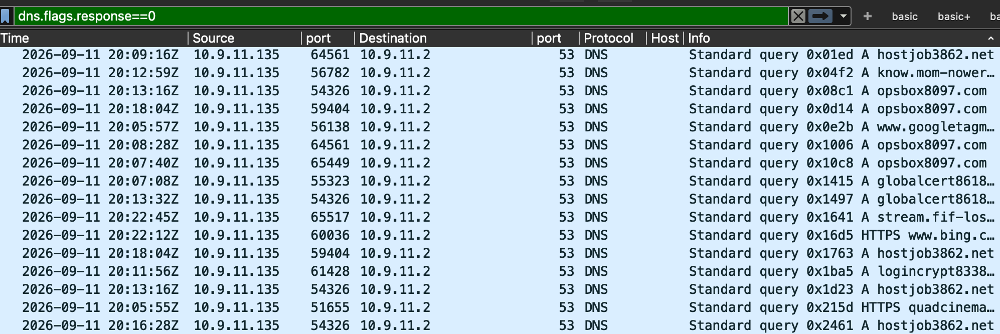
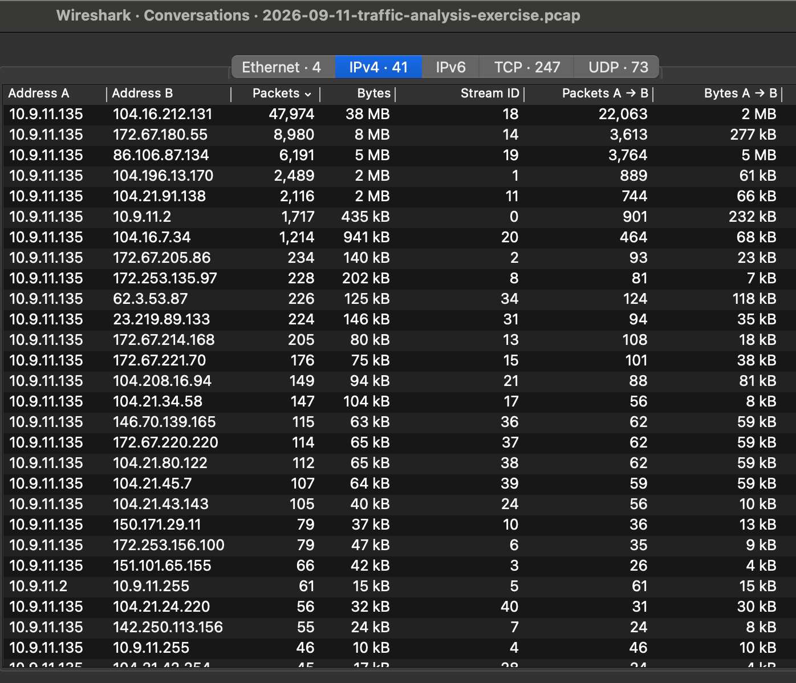
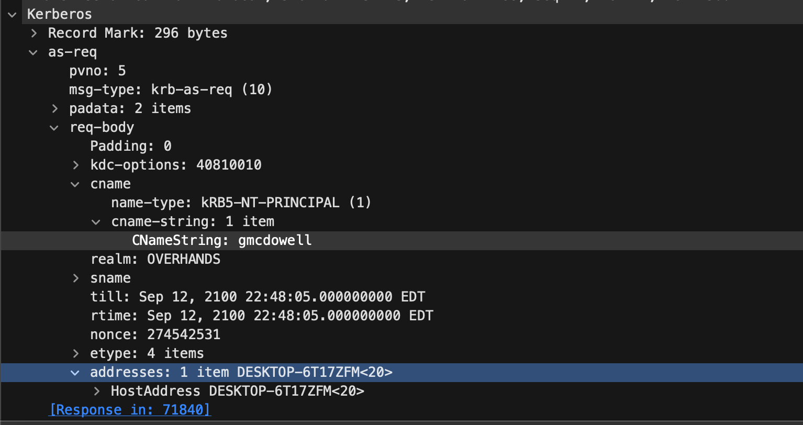
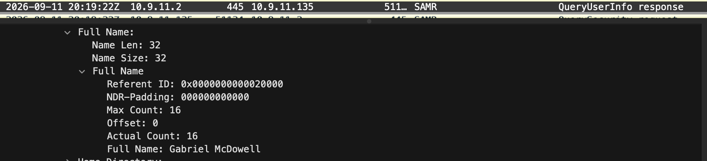

# Traffic Analysis Report: KongTuke ClickFix Infection on Host 10.9.11.135

**Analyst:** CJ Turesko

**Report date:** 2026-09-16

**Classification:** Training exercise (not a real-world incident)

**Source material:** Public pcap from the malware-traffic-analysis.net post ["2026-09-11: Traffic Analysis Exercise - Kongtuke Rebuke!"](https://www.malware-traffic-analysis.net/2026/09/11/index.html)

> This write-up is based on a publicly available training pcap, analyzed independently in Wireshark as SOC-analyst practice. It is not a redistribution of the original file; the pcap itself remains available directly from malware-traffic-analysis.net under its own access terms. The exercise also provided text files of the raw ClickFix HTTPS traffic and malware artifacts pulled from the infected host; those were not opened for this report, since the pcap alone is sufficient for a network-side analysis and handling live malware samples is outside the scope of this exercise.

---

## 1. Executive Summary

The exercise supplied only an environment reference sheet, not a specific alert or flagged IP, so the first task was to scope which host on the LAN segment was actually infected before anything else could be identified. Filtering the capture down to outbound DNS queries surfaced a single internal host, **10.9.11.135**, resolving a run of newly-registered-looking domains consistent with KongTuke's ClickFix delivery infrastructure, beginning less than half a second into the capture. Pivoting through the same host's Kerberos and SAMR traffic identified the machine as **DESKTOP-6T17ZFM**, logged on as **gmcdowell**, resolving to the full name **Gabriel McDowell**. A repeating HTTP beacon to a likely command-and-control (C2) domain began roughly a minute into the capture and continued at short intervals through the end of the recording, indicating an active, persistent implant rather than a one-time download.

| Item | Value |
|---|---|
| Infected host (IP) | 10.9.11.135 |
| Hostname | DESKTOP-6T17ZFM |
| MAC address | 08:d4:0c:7a:29:1e |
| Logged-on user (account) | gmcdowell |
| Logged-on user (full name) | Gabriel McDowell |
| Malware family / cluster | KongTuke ClickFix (per exercise material) |
| First observed suspicious DNS query | 2026-09-11 20:05:56 UTC |
| First observed C2-style beacon | 2026-09-11 20:06:57 UTC |

---

## 2. Environment Reference & Starting Point

Unlike an alert-driven investigation, this exercise provided no IDS signature or pre-flagged external IP, just an environment reference sheet and the pcap itself:

| Item | Value |
|---|---|
| LAN segment | 10.9.11.0/24 |
| Gateway | 10.9.11.1 |
| Domain | overhands.org |
| AD environment name | OVERHANDS |
| Domain controller | 10.9.11.2 (WIN-GTWXC9UYSE4) |

I checked this reference against the capture rather than assuming it was accurate: DNS responses for `WIN-GTWXC9UYSE4.overhands.org`, along with every Kerberos/LDAP/SAMR conversation involving the DC, consistently show it answering from 10.9.11.2, matching the reference sheet exactly. No discrepancy here, but it's a habit worth keeping regardless, since a reference sheet is only as good as whoever last updated it.

With no alert to pivot from, the investigation had to start cold from the traffic itself.

---

## 3. Investigation & Methodology

### 3.1 Scoping the infected host

With nothing pre-flagged, I started with:

```
dns.flags.response == 0
```

This isolates every outbound DNS query in the capture, which is a reasonable first move when there's no alert to anchor on: a workstation's DNS queries are a compact record of everywhere it tried to go, legitimate or not. Scrolling that filtered list, the query source was almost entirely one internal IP, **10.9.11.135**, which by itself only tells you it's the busier of the two hosts on this small segment. What actually confirmed it as the infected machine was the query names themselves: interleaved with ordinary traffic (Microsoft telemetry, Google Analytics, the jQuery CDN) was a cluster of lookups for domains with no legitimate reason to be contacted from a corporate workstation, `aatthews.cfd`, `winrun2915.com`, `logincrypt8338.com`, `opscast3707.net`, and several subdomains under `xos-aploq.com`. That kind of naming, a dictionary word bolted to a string of digits, sitting on an abused TLD like `.cfd`, and resolved back-to-back in a single browsing session, is a pattern I'd flag as bulk-registered, disposable infrastructure regardless of which host it came from. Here it happened to confirm the same host the volume already pointed to; in a larger environment with many workstations, this is the check that would actually matter, since traffic volume alone doesn't reliably identify a compromise.



*Figure 1: Outbound DNS queries (frames 41-14272) from 10.9.11.135, showing the cluster of newly-registered-looking domains resolved within the first minute of the capture.*

I cross-checked this against Statistics -> Conversations (IPv4): 10.9.11.135 is by far the most active endpoint in the capture, and it's paired against the DC or external addresses in every single conversation, there is no third internal host on this segment. That's a useful sanity check but not the primary evidence; it confirms scope, the DNS pattern confirms infection.



*Figure 2: Statistics > Conversations (IPv4), confirming 10.9.11.135 as the only client on the LAN segment and the source of nearly all traffic in the capture.*

### 3.2 Confirming host identity (MAC address)

With the IP established, the Ethernet source address on any packet from that same conversation gives the MAC directly, no separate lookup needed: `08:d4:0c:7a:29:1e`.

### 3.3 Identifying the host name

Filtering to Kerberos traffic from the infected host:

```
ip.addr == 10.9.11.135 and kerberos.CNameString
```

narrows the capture to the AS-REQ/AS-REP/TGS-REP frames that carry a plaintext identity field. In this capture the `cname` field in every one of those requests already reads `gmcdowell`, the human account (there's no separate machine-account request ending in `$` the way a fresh boot-time request would show). The hostname instead comes from a different field in the same AS-REQ body: Windows Kerberos clients optionally populate an `addresses` field with the local machine's NetBIOS name for logging/compatibility purposes, and that field is present here, `DESKTOP-6T17ZFM<20>` (address type `nETBIOS`, service `<20>` for the Server service).



*Figure 3: AS-REQ packet (frame 71838), showing the client's NetBIOS name in the `addresses` field of the request body.*

### 3.4 Identifying the user account

That same field group in the AS-REQ carries the account name directly in `cname-string`, no separate pivot required here since this capture doesn't show a distinct machine-account logon ahead of the user session: `gmcdowell`, under realm `OVERHANDS`.

A note on a filter that looks similar but isn't: Kerberos AS-REQ packets also carry an `sname` field, the service being requested rather than the requester, and it will almost always read `krbtgt`, the built-in name for a Ticket Granting Ticket present in essentially every AS-REQ on any Windows domain. It's easy to grab the wrong field at a glance; `cname` is the requester, `sname` never is.

### 3.5 Resolving the user's full name

Kerberos doesn't carry a human-readable display name in any message type, so this needed a different protocol. Checking Statistics -> Protocol Hierarchy against the whole capture shows SMB/SAMR traffic between 10.9.11.135 and the domain controller alongside the expected Kerberos and LDAP. SAMR (Security Account Manager Remote) is the protocol Windows itself uses to resolve a SAM account name into a display name, it's what backs `net user` and the "Welcome, [Full Name]" logon banner, so it was a reasonable next place to check rather than a guess.

Filtering:

```
ip.addr == 10.9.11.135 and samr
```

a `QueryUserInfo` response (frame 71543, timestamped 2026-09-11 20:19:22 UTC) returns the account's full name directly:

```
Full Name: Gabriel McDowell
```



*Figure 4: SAMR `QueryUserInfo` response (frame 71543), resolving the account to display name "Gabriel McDowell."*

---

## 4. Indicators of Compromise

| Type | Value |
|---|---|
| Malware cluster | KongTuke ClickFix |
| Infected host | 10.9.11.135 |
| Hostname | DESKTOP-6T17ZFM |
| MAC address | 08:d4:0c:7a:29:1e |
| User account | gmcdowell (Gabriel McDowell) |

### Domains observed

| Time first seen (UTC) | Domain | Role (assessed) |
|---|---|---|
| 20:05:56 | aatthews[.]cfd | Fake verification / ClickFix landing page |
| 20:06:32 | winrun2915[.]com | Payload/stager infrastructure |
| 20:06:35 | logincrypt8338[.]com | Payload/stager infrastructure |
| 20:06:38 | opscast3707[.]net | Payload/stager infrastructure |
| 20:06:41 | xos-aploq[.]com (+ subdomains) | Payload/stager infrastructure |
| 20:06:57 | know.mom-nower[.]com | HTTP C2 beacon, static hex ID in URI path |

*(`quadcinema.com`, the first domain queried in the capture, is a legitimate site; KongTuke's ClickFix chain typically starts from a compromised or malvertising-injected legitimate page rather than an obviously malicious one, so its presence here is expected and not itself an indicator.)*

---

## 5. Scope Limitations

This capture shows the network side of the infection only. The actual ClickFix step, the user being shown a fake CAPTCHA/verification prompt and pasting a command into the Windows Run dialog, happens locally on the host and isn't visible in a pcap; the exercise's separate ClickFix script text file would confirm that step, but it wasn't reviewed for this report. Endpoint telemetry (PowerShell ScriptBlock logging, Sysmon process creation, or EDR) would be needed to confirm exactly what was executed and to identify persistence mechanisms.

---

## 6. Recommendations

- Isolate DESKTOP-6T17ZFM (10.9.11.135) from the network pending forensic imaging.
- Force a password reset for the `gmcdowell` account and review recent authentication activity for signs of misuse.
- Block the domains listed above at the DNS/proxy layer.
- Hunt across the environment for DNS queries matching the same pattern (short dictionary-word-plus-digits domains, abused TLDs like `.cfd`) to catch additional affected hosts.
- Review endpoint logs on the affected host for the `mshta.exe`/`powershell.exe` execution that would correspond to the ClickFix clipboard-paste step, since this capture only shows the resulting network traffic, not the local execution.
- Reinforce user awareness that no legitimate site will ask a visitor to open the Run dialog and paste a command to "verify" they're human.

---

## 7. Tools & References

- Wireshark / tshark (packet analysis)
- Source pcap: [malware-traffic-analysis.net (2026-09-11)](https://www.malware-traffic-analysis.net/2026/09/11/index.html)
