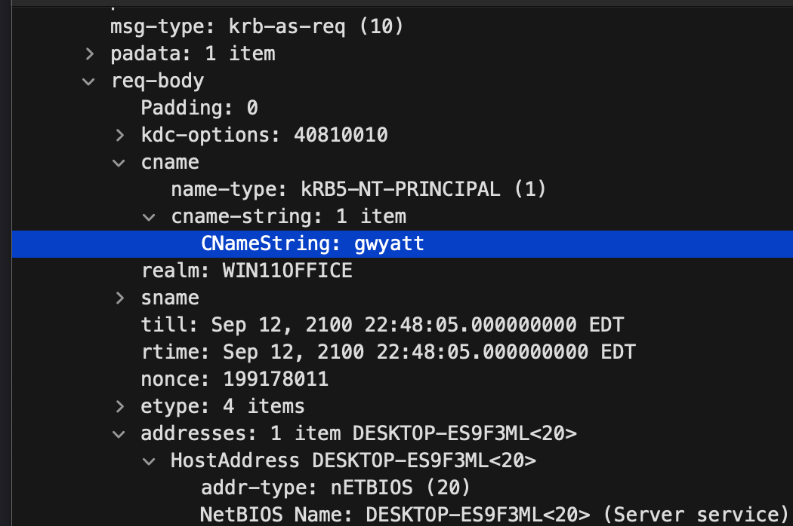
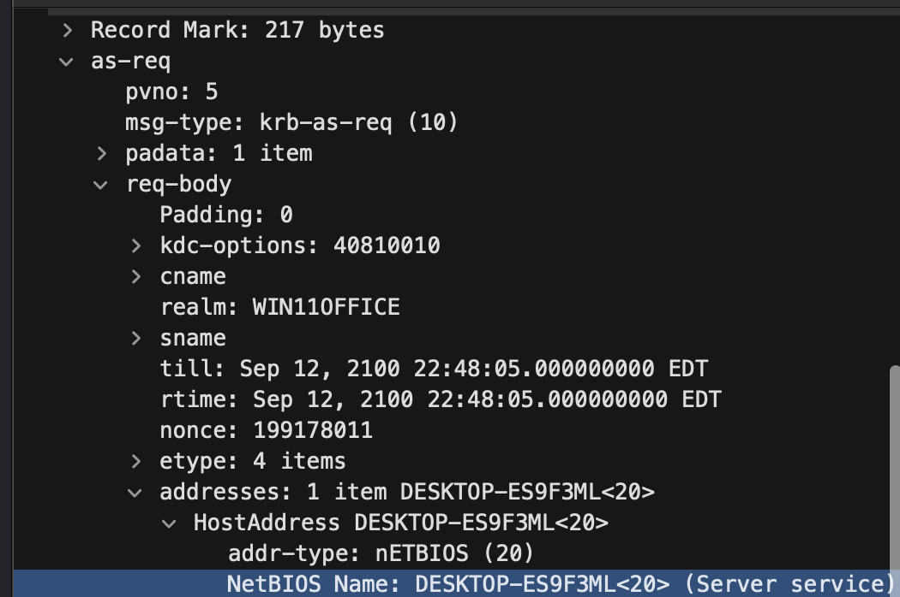
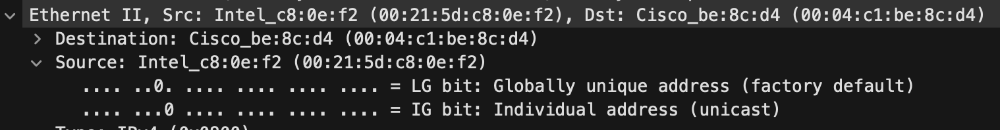
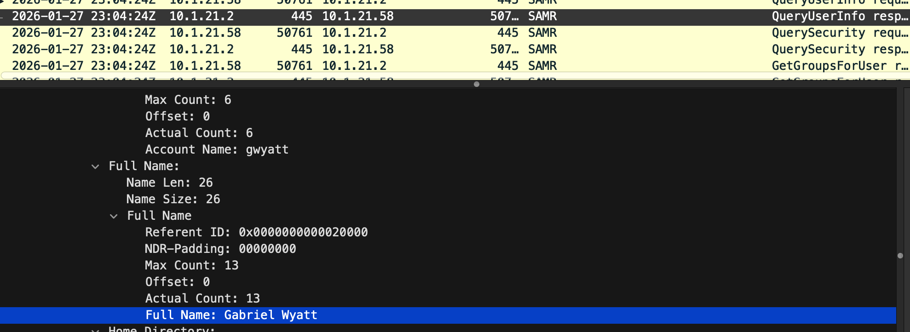
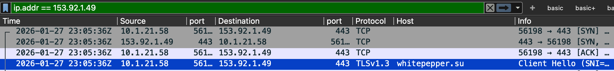
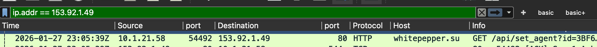

# Traffic Analysis Report: Lumma Stealer C2 Activity on Host 10.1.21.58

**Analyst:** CJ Turesko

**Report date:** 2026-09-12

**Classification:** Training exercise (not a real-world incident)

**Source material:** Public pcap from the malware-traffic-analysis.net post ["2026-01-31: Traffic analysis exercise: Lumma in the room-ah"](https://www.malware-traffic-analysis.net/2026/01/31/index.html)

> This write-up was made for practice analyzing pcap files. The six identification questions below (infected IP, MAC address, host name, user account, full name, and the malicious domain behind the alert) come from a public traffic analysis exercise at malware-traffic-analysis.net. That exercise notes the findings are meant to feed an incident report for the response team, so rather than just listing the six answers, this is an attempt to put them into an incident-report-shaped write-up as further practice, not a claim of prior on-the-job incident response experience. It is not a redistribution of the original file; the pcap itself remains available directly from malware-traffic-analysis.net under its own access terms.

---

## 1. Executive Summary

The SOC alerting stack fired a signature, "ET MALWARE Lumma Stealer Victim Fingerprinting Activity," on 2026-01-27 at approximately 23:05 UTC, triggered by outbound TCP/80 traffic to external IP 153.92.1[.]49. Analyzing the packet capture pulled for the source host identified **10.1.21.58 (DESKTOP-ES9F3ML)** as the infected asset, logged on as **gwyatt (Gabriel Wyatt)**. The host's first confirmed contact with the alerted infrastructure, domain **whitepepper[.]su**, occurred at 23:05:36 UTC, followed by an HTTP fingerprinting check-in that matches the alert's stated protocol and port. No initial infection vector (delivery email, dropper download, etc.) is visible in this capture; the recorded window opens only 20 seconds before the host's first domain logon.

| Item | Value |
|---|---|
| Infected host (IP) | 10.1.21.58 |
| Hostname | DESKTOP-ES9F3ML |
| MAC address | 00:21:5d:c8:0e:f2 |
| Logged-on user (account) | gwyatt |
| Logged-on user (full name) | Gabriel Wyatt |
| Malware family | Lumma Stealer (per alert signature) |
| Malicious domain | whitepepper.su (153.92.1.49) |
| First observed C2 traffic | 2026-01-27 23:05:36 UTC |
| Last observed C2 traffic (within capture) | 2026-01-27 23:06:06 UTC |

---

## 2. Alert Details

| Field | Value |
|---|---|
| Signature | ET MALWARE Lumma Stealer Victim Fingerprinting Activity |
| Malicious IP | 153.92.1[.]49 |
| Protocol / Port | TCP/80 |
| Alert timestamp | 2026-01-27 23:05 UTC |
| Detection source | Network intrusion detection system |

Environment reference (as provided by the SOC): LAN segment 10.1.21.0/24, gateway 10.1.21.1, domain win11office.com (AD environment WIN11OFFICE), domain controller at 10.1.21.2.

---

## 3. Investigation & Methodology

### 3.1 Scoping the infected host

The alert names only the external indicator, 153.92.1.49, not an internal IP. "The signature already did the hard part of confirming that IP is bad; the job here is just to find which internal host touched it," so the first filter built was against the alerted address itself rather than against, say, the domain controller:

```
ip.addr == 153.92.1.49
```

In a full multi-host capture, whichever internal address shows up in that filter is the infected host, regardless of how many other machines are on the segment, because the pivot point is the confirmed indicator, not a guess about what "looks weird." In this capture that address is **10.1.21.58**. (If more than one internal host had appeared, each would need to be checked against the alert's exact match conditions, protocol, port, and URI pattern, before treating it as a separate infection, since a flagged IP can also be shared hosting that serves unrelated traffic to other hosts.)

### 3.2 Identifying the host name and user account

Filtering:

```
ip.addr == 10.1.21.2 and kerberos
```

surfaces the host's Kerberos AS-REQ to the domain controller. Its `cname` field identifies the account requesting authentication, **gwyatt**, and its `HostAddress` field identifies the requesting client by NetBIOS name. The host name was cross-checked against the NetBIOS name registration broadcasts sourced by 10.1.21.58 directly; both sources agree on **DESKTOP-ES9F3ML**.



*Figure 1: Kerberos AS-REQ `cname` field identifying the requesting account as `gwyatt`.*



*Figure 2: NetBIOS name registration broadcast confirming host name `DESKTOP-ES9F3ML`.*

### 3.3 Confirming host identity (MAC address)

The MAC address was pulled from the Ethernet source field of a frame transmitted by the host. A frame's source MAC always identifies the device that actually put it on the wire, whether that frame's destination is another local device, a broadcast address, or, as in Figure 3 below, an external IP reached through the gateway; in that last case the *destination* field shows the gateway's MAC as the next hop, but the source field is unaffected. MAC addresses have meaning only within the local Ethernet segment, so the technique that does not work is trying to attribute a MAC to a device beyond that segment (for example, the C2 server itself): any traffic to or from an external address will only ever show the gateway's MAC representing that next hop, never a hardware address for the remote host.



*Figure 3: Ethernet II header on an outbound frame from 10.1.21.58, showing source MAC `00:21:5d:c8:0e:f2` and destination MAC `00:04:c1:be:8c:d4` (the gateway, next hop toward an external address).*

Confirmed MAC address: **00:21:5d:c8:0e:f2**.

### 3.4 Resolving the user's full name

Kerberos does not carry a human-readable display name in any message type; the AS-REQ/AS-REP exchange only ever carries the account (principal) name. Running Statistics -> Protocol Hierarchy against the capture surfaces **SAMR** (Security Account Manager Remote) traffic between the host and the domain controller, alongside Kerberos and LDAP. "SAMR is the protocol Windows itself uses to resolve a SAM account name into a full display name, it's what backs the 'Welcome, [Full Name]' text on a logon screen," so it was a reasonable next place to check rather than an arbitrary guess.

Filtering:

```
ip.addr == 10.1.21.2 and samr
```

turns up a full SAMR enumeration chain (Connect, EnumDomains, LookupDomain, OpenDomain, LookupNames, OpenUser, QueryUserInfo) beginning about 180 ms after the AS-REQ above, which is native Windows logon behavior resolving the account's display info, not attacker reconnaissance by itself. The `SamrQueryInformationUser` response in that chain contains the account and full name together in the same field group:

```
Account Name: gwyatt
Full Name:    Gabriel Wyatt
```



*Figure 4: SAMR `QueryUserInfo` response resolving account `gwyatt` to full name "Gabriel Wyatt."*

### 3.5 Confirming the malicious domain

At 23:05:36 UTC the host opened a TLS session to 153.92.1.49 with a Client Hello SNI of `whitepepper.su`, confirming the domain named in the alert.



*Figure 5: TLS Client Hello showing SNI `whitepepper.su` to 153.92.1.49.*

This SNI observation is on TCP/443, while the alert specifically named TCP/80. Filtering directly on the alert's stated port:

```
ip.addr == 153.92.1.49 and tcp.port == 80
```

surfaces the actual traffic that matched the signature: an HTTP GET to `whitepepper.su` for `/api/set_agent`, carrying a bot identifier, an authentication token, and an `agent` parameter identifying the browser (`Chrome`). A follow-up POST to the same endpoint one second later, with an `act=log` parameter, indicates submission of collected data. A second check-in cycle about eight seconds later repeats the pattern with `agent=Edge`, indicating the malware enumerated more than one installed browser on the host.



*Figure 6: HTTP GET to `whitepepper.su`, `/api/set_agent`, on TCP/80, the specific request that matches the alerting signature.*

The TCP/443 session in Figure 5 and the TCP/80 request in Figure 6 are two separate channels to the same C2 infrastructure. Only the latter matches the alert's stated protocol and port, and should be treated as the primary evidentiary artifact for this specific alert. No further communication with 153.92.1.49 was observed after 23:06:06 UTC for the remainder of the capture.

---

## 4. Indicators of Compromise

| Type | Value |
|---|---|
| Malware family | Lumma Stealer |
| Infected host | 10.1.21.58 |
| Hostname | DESKTOP-ES9F3ML |
| MAC address | 00:21:5d:c8:0e:f2 |
| User account | gwyatt (Gabriel Wyatt) |
| Domain | whitepepper.su |
| IP address | 153.92.1.49 |
| URI pattern | `/api/set_agent?id=...&token=...&agent=...` |
| Bot ID | `3BF67EC05320C5729578BE4C0ADF174C` |
| Token | `842e2802df0f0a06b4ed51f12f4387e761523b` |

---

## 5. Scope Limitations

This capture begins only 20 seconds before the host's first observed domain logon (23:04:24 UTC) and roughly 70 seconds before first contact with whitepepper.su; no delivery mechanism (phishing email, malicious download, dropper) is visible in that window. Establishing initial access would require additional sources not present in this pcap: endpoint (EDR) process and file telemetry, proxy/web logs, or an email gateway log.

---

## 6. Recommendations

- Isolate 10.1.21.58 (DESKTOP-ES9F3ML) from the network pending forensic imaging.
- Reset the domain password for the `gwyatt` account and any local accounts on the host; treat all credentials used on this machine as compromised.
- Invalidate active browser sessions and cookies for this user across corporate applications, since Lumma Stealer targets browser-stored credentials, cookies, and autofill data.
- Block the indicators listed above at the firewall, proxy, and DNS layers, and search other endpoints for communication with the same indicators.
- Submit the host for EDR process and file-write telemetry review covering the period leading up to 23:05:36 UTC to determine the initial infection vector, since this pcap alone doesn't cover that.

---

## 7. Tools & References

- Wireshark / tshark (packet analysis)
- Source pcap: [malware-traffic-analysis.net (2026-01-31)](https://www.malware-traffic-analysis.net/2026/01/31/index.html)
- Suricata/ET Open ruleset (source of the "Lumma Stealer Victim Fingerprinting Activity" alert signature referenced above)
